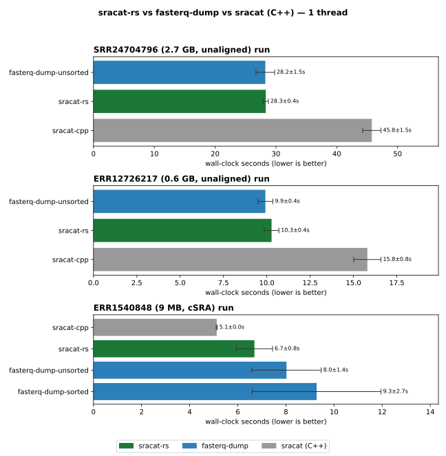
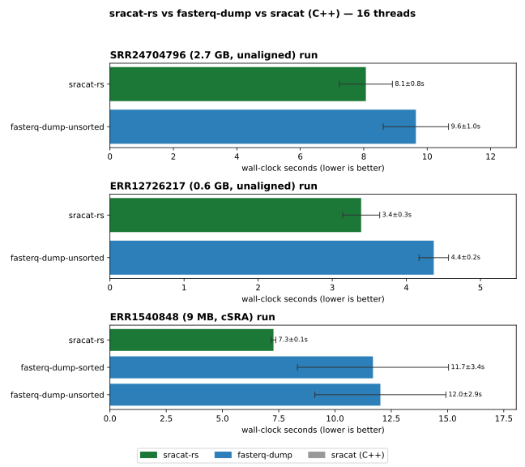

# sracat-rs

A fast, deterministic reimplementation of `fasterq-dump` (the sra-tools
extractor) with a focus on flexibly streaming outputs and avoiding the use of temporary files. 

## Examples

`sracat-rs` reads one or more `.sra` files (or accessions) and writes reads in
FASTA (default) or FASTQ (`--qual`). The key choice is **where the output goes**;
the various output options let you shape it for the next tool without temp files.
Paired reads (spots with two biological reads) are emitted interleaved (`/1`,
`/2`) by default, while single/orphan reads are routed separately and never
silently dropped.

```sh
# Stream interleaved paired reads to stdout (FASTA) — pipe straight into a mapper
sracat-rs run.sra | head

# FASTQ instead of FASTA (adds quality scores)
sracat-rs --qual run.sra > reads.fastq

# Split paired and single reads into prefixed files:
#   out.paired.fasta  (interleaved pairs)
#   out.single.fasta  (single/orphan reads)
sracat-rs -o out run.sra

# Split mates into separate read1 / read2 files (orphans -> their own file).
# Here as FASTQ: -> r1.fastq, r2.fastq, singles.fastq
sracat-rs -1 r1.fastq -2 r2.fastq --single-out singles.fastq --qual run.sra

# Stream pairs to stdout but capture single/orphan reads in a file
sracat-rs --single-out singles.fasta run.sra > pairs.fasta

# Include technical reads (adapters/barcodes) that are dropped by default
sracat-rs --include-technical -o out run.sra

# Decode with 16 threads — output stays byte-identical to single-threaded
sracat-rs --qual -t 16 -o out run.sra

# Refuse aligned (cSRA) runs instead of extracting them
sracat-rs --croak-on-aligned run.sra

# Multiple runs are concatenated into the one output
sracat-rs -o out a.sra b.sra c.sra
```

The output destinations are mutually constrained: `-o/--output-prefix` is its
own mode (prefixed files), `-1`/`-2` split mates into two files (and require
each other), and bare invocation streams pairs to stdout. In any mode where the
run contains unpaired reads, give them a home with `--single-out` (or use `-o`,
which provides one) or `sracat-rs` will error rather than drop them. See
[Usage](#usage) for the full option reference.

## Why

The original `sracat` uses the NGS C++ API (`ncbi::NGS::openReadCollection`),
which is only available in ncbi-vdb 2.x. `sracat-rs` instead binds the
lower-level VDB cursor API present in current ncbi-vdb (3.4.1), reading the
`SEQUENCE` table's `READ` / `READ_LEN` / `READ_TYPE` columns in storage order.

Benefits:

- **Repeatable order.** Reads are emitted in `SEQUENCE`-table row order,
  single-threaded — byte-identical across runs (unlike `fasterq-dump
  --fasta-unsorted` with multiple threads).
- **Faster.** (with many threads) Quicker than both `fasterq-dump` and the NGS-based C++ `sracat` on
  the same data (no per-fragment allocations, no NGS virtual-dispatch layer;
  reads column blobs directly).
- **Paired / single aware.** Spots with two biological reads are emitted
  interleaved (`/1`, `/2`); spots with a single biological read are routed to a
  separate stream.
- **Flexible streaming output.** Pick the shape that fits the next tool, all
  without temp files: interleaved pairs to **stdout** (pipe straight into a
  mapper/assembler), split mates into separate **`-1`/`-2`** files, or prefixed
  files — while single/orphan reads are always routed to their own destination
  (and never silently dropped).
- **Aligned-aware.** Aligned (cSRA) runs are extracted by default by reading the
  computed `READ` column; pass `--croak-on-aligned` to refuse them instead.

## Install

### 1. From Bioconda (recommended)

`sracat-rs` is packaged on [Bioconda](https://bioconda.github.io/), so the
easiest install pulls the binary and its ncbi-vdb dependency together:

```sh
conda install -c bioconda -c conda-forge sracat-rs
# or, faster:
mamba install -c bioconda -c conda-forge sracat-rs
# or with pixi, into a project/global env:
pixi add sracat-rs
```

This is the recommended route for most users — no toolchain, no build step.

### 2. Prebuilt binaries from the release page

Each release ships statically-linked binaries built in CI by the
[`cargo-dist`](https://opensource.axo.dev/cargo-dist/) pipeline. Grab them from
the [GitHub releases](https://github.com/wwood/sracat-rs/releases) page, either
by downloading an archive directly or via the shell installer published with the
release:

```sh
curl --proto '=https' --tlsv1.2 -LsSf \
    https://github.com/wwood/sracat-rs/releases/latest/download/sracat-rs-installer.sh | sh
```

Because these binaries are statically linked against ncbi-vdb (see below), they
are self-contained and relocatable — no conda environment required at runtime.

### 3. From source inside the pixi environment

`sracat-rs` links against **ncbi-vdb**, a conda-provided C library, so it cannot
be built from a bare checkout: `build.rs` needs `CONDA_PREFIX` to point at a pixi
environment that supplies the ncbi-vdb headers and library. There is no fully
standalone `cargo install` — the C dependency has to come from somewhere. The
pixi env in this repo provides everything (Rust toolchain, C compiler, ncbi-vdb):

```sh
pixi run build           # cargo build --release -> target/release/sracat-rs
```

#### Static vs. dynamic linking

The link mode is selected by the `SRACAT_VDB_LINK` environment variable:

- **`dylib` (default)** — links `libncbi-vdb.so` and bakes `$CONDA_PREFIX/lib`
  into the binary as an rpath. Fast to link and convenient for local dev, but the
  binary then depends on that exact pixi env still existing on disk. This is what
  `pixi run build` uses.
- **`static`** — links `libncbi-vdb.a` instead. The binary carries no
  `libncbi-vdb.so` dependency and **no conda-path rpath**, so it is
  self-contained and relocatable. This is the right mode for anything you intend
  to ship or move between machines (and is what the release binaries above use).

So to `cargo install` a clean, relocatable binary, do it from inside the pixi env
(so `CONDA_PREFIX` is set) and ask for the static link:

```sh
# from a checkout
pixi run -- env SRACAT_VDB_LINK=static cargo install --path .

# or from crates.io
pixi run -- env SRACAT_VDB_LINK=static cargo install sracat-rs
```

If you install with the default `dylib` mode, the resulting binary will contain
an rpath pointing at your local pixi env and will break if that env is removed.

## Benchmarks

`benchmarking/` holds a self-contained comparison of `sracat-rs` against
**`fasterq-dump`** (the primary comparison) and the original C++ `sracat` (for
reference), on three runs: two unaligned (SRR24704796, 2.7 GB; ERR12726217,
0.6 GB) and one aligned cSRA (ERR1540848, 9 MB). The inputs are fetched with
[`kingfisher`](https://github.com/wwood/kingfisher-download) via `Snakefile`,
and the benchmark `pixi.toml` builds the C++ `sracat` against conda-provided
ncbi-vdb 2.11 + NGS libraries so the original tool can be measured reproducibly:

```sh
cd benchmarking
pixi run -e download download   # fetch the SRA inputs with kingfisher
pixi run build-cpp              # compile ../../sracat/sracat.cpp against conda libs
# run on a dedicated allocation (a shared login node hides thread scaling). Each
# input is staged to node-local $TMP first so shared-FS IO isn't the bottleneck:
mqsub --no-email -t 16 -m 96 --hours 2 -- \
    pixi run --manifest-path benchmarking/pixi.toml bench
pixi run plot                   # results.tsv -> comparison-t{1,16}.svg
```

Each tool is run at one thread and at sixteen, giving a single-threaded and a
multi-threaded comparison, and is timed **four times per configuration** — the
first run is discarded as a warm-up and the bars show the mean of the remaining
three with error bars for the standard deviation. All tools emit identical read
counts per run (55,562,334 / 17,218,060 / 380,432).

**Single-threaded:**



**16 threads:**



Wall time in seconds (mean ± stdev of 3 timed runs after a warm-up) on a
dedicated 16-core compute node:

| run | sracat (C++) t1 | fasterq-dump t1 | fasterq-dump t16 | sracat-rs t1 | sracat-rs t16 |
| --- | --: | --: | --: | --: | --: |
| SRR24704796 (2.7 GB, unaligned) | 45.8 ± 1.5 | 28.3 ± 1.5 | 9.6 ± 1.0 | 28.3 ± 0.4 | **8.1 ± 0.8** |
| ERR12726217 (0.6 GB, unaligned) | 15.8 ± 0.8 | 9.9 ± 0.4 | 4.4 ± 0.2 | 10.3 ± 0.4 | **3.4 ± 0.3** |
| ERR1540848 (9 MB, cSRA) | **5.1 ± 0.0** | 9.3 ± 2.7 | 11.7 ± 3.4 | 6.7 ± 0.8 | 7.3 ± 0.1 |

(Bold marks the fastest tool per row. fasterq-dump columns are
`--fasta-unsorted` for the unaligned runs and `--fasta` sorted for the cSRA. For
the cSRA, sracat-rs caps itself to one thread, so its `t16` figure is the
single-threaded run — see below.)

`fasterq-dump --fasta-unsorted` is multi-threaded but **not order-stable**;
`fasterq-dump --fasta` (sorted) is deterministic but builds temp files.
`sracat-rs` is deterministic *and* temp-file-free in every mode and runs against
current ncbi-vdb (3.x). On the unaligned runs its decode scales with `-t`
(~3.5× and ~3.0× from 1→16 threads here), landing ~1.2–1.3× faster than
multi-threaded `fasterq-dump` and well ahead of the C++ `sracat`. On the cSRA,
`fasterq-dump` actually slows down with more threads (the tiny aligned run
doesn't amortise the extra workers, hence its wide error bars), so single-thread
`sracat-rs` is ~1.6× faster than 16-thread `fasterq-dump` with no temp dir —
though the C++ `sracat` is a little quicker still. Aligned extraction does not
parallelise, so `sracat-rs` **hard-caps aligned runs to a single thread** (`-t16`
above is therefore the same single-threaded run; see
[Aligned (cSRA) runs](#aligned-csra-runs)). Benchmark on dedicated cores — on a
contended shared node CPU competition masks the thread scaling.

## Algorithmic approach

`sracat-rs` treats an SRA run as a column store and walks it row by row, doing
the read-pairing logic itself instead of delegating to the NGS fragment
iterator.

1. **Open through the VDB cursor API.** A small C shim (`shim.c`, wrapped by
   `src/ffi.rs`) opens the run with `ncbi-vdb` and adds cursor columns on the
   `SEQUENCE` table:
   - `(INSDC:dna:text)READ` — the concatenated bases for a spot,
   - `(INSDC:coord:len)READ_LEN` — the length of each read within the spot,
   - `(INSDC:SRA:read_type)READ_TYPE` — per-read flags (the low bit marks a
     *biological* read vs. a technical one such as an adapter/barcode),
   - `(INSDC:quality:phred)QUALITY` — only when `--qual` is requested.

2. **Detect aligned runs.** If the object is a database containing a
   `PRIMARY_ALIGNMENT` table, the stored `READ` is reconstructed from alignments
   rather than held verbatim. The shim reports this; by default such runs are
   extracted anyway (and forced single-threaded, since reconstruction does not
   parallelise — step 6), while `--croak-on-aligned` opts into refusing them (see
   [Aligned (cSRA) runs](#aligned-csra-runs)).

3. **Iterate spots in storage order.** Rows are visited from `first_row()` for
   `row_count()` rows — i.e. in the physical order blobs are stored, *not* spot
   submission order. This is what makes the output deterministic and
   sequential-IO friendly. For each spot the shim returns borrowed slices into
   the cursor's blob (bases, optional qualities, `READ_LEN`, `READ_TYPE`) with
   no copy.

4. **Split and classify each spot.** Using `READ_LEN` as offsets into the `READ`
   blob, each spot is sliced into its component reads. Technical reads are
   dropped unless `--include-technical`. The number of *selected* (biological)
   reads decides routing:
   - **0** → spot skipped (counted as "no biological reads"),
   - **1** → a single/orphan read → the **single** stream,
   - **2** → a mate pair → emitted **interleaved** (`/1` then `/2`) to the
     **paired** stream,
   - **>2** → an error (unusual layout; rerun with `--include-technical` to
     inspect).

   Read names are `‹run›.‹row›` (with `/1`, `/2` suffixes for pairs), where
   `‹run›` is the file stem.

5. **Format and write.** FASTA by default, or FASTQ with `--qual` (phred scores
   are offset by 33 into ASCII in a reused scratch buffer). Paired reads are
   emitted interleaved to stdout (or `‹prefix›.paired.{fasta,fastq}`), or split
   with `-1`/`-2` (forward read to one file, reverse to the other); single reads
   go to `--single-out` / `‹prefix›.single.{fasta,fastq}`. If a single read
   appears with no destination configured, `sracat-rs` errors rather than
   silently dropping it.

6. **Optional parallel decode (`-t N`).** Decoding (especially `QUALITY`) is the
   CPU bottleneck. With `N > 1`, the row range is split into fixed-size chunks
   (8192 spots). Each worker owns its own cursor and claims the next chunk via an
   atomic counter, formats it into in-memory buffers, and hands `(chunk-index,
   buffers)` to a single writer thread, which reorders chunks by index (through a
   `BTreeMap`) and emits them consecutively — so the output is **byte-identical
   to the single-threaded run**, with no temp files. Memory stays flat via a
   **bounded buffer**: a window caps how many chunks may be decoded ahead of the
   writer (workers spin/yield when they get too far in front), so peak memory is
   `O(threads × chunk)` rather than growing with the run size.

## Build

Everything (Rust toolchain, C compiler, ncbi-vdb headers + shared library,
plus snakemake + sra-tools for test data) is provided by the pixi environment:

```sh
pixi run build           # cargo build --release
pixi run fetch-testdata  # snakemake: prefetch the cSRA test fixture
pixi run test            # cargo test (depends on fetch-testdata)
```

The release binary lands at `target/release/sracat-rs`. The path to
`libncbi-vdb.so` is baked in as an rpath, so the binary runs outside `pixi run`
as long as that environment still exists.

## Usage

```
sracat-rs [OPTIONS] <SRA>...
```

| option | meaning |
| ------ | ------- |
| `<SRA>...` | one or more `.sra` files or accessions (output concatenated) |
| `-o, --output-prefix <PREFIX>` | write pairs to `<PREFIX>.paired.{fasta,fastq}` and singles to `<PREFIX>.single.{fasta,fastq}` instead of streaming to stdout |
| `-1, --read1 <FILE>` | split pairs: write the forward read of each pair here (requires `-2`; mutually exclusive with `-o`) |
| `-2, --read2 <FILE>` | split pairs: write the reverse read of each pair here (requires `-1`) |
| `--single-out <FILE>` | when streaming/splitting pairs, send single/orphan reads here |
| `--qual` | write FASTQ (sequence + quality) instead of FASTA |
| `--include-technical` | include technical reads (default: biological only) |
| `--croak-on-aligned` | refuse aligned (cSRA) runs instead of extracting them (default: extract) |
| `-t, --threads <N>` | parallel decode threads (default 1); output stays byte-identical. Ignored for aligned (cSRA) runs, which are always single-threaded |
| `-h, --help` / `-V, --version` | help / version |

Default behaviour streams interleaved **paired** reads to **stdout**. With
`-1`/`-2` the pairs are instead split — forward read to `-1`, reverse read to
`-2` (each read keeps its `/1`,`/2` suffix). In every mode, if the run contains
any unpaired (single/orphan) reads and no destination for them is given,
`sracat-rs` refuses rather than dropping them — pass `--single-out` or `-o`.

```sh
# stream interleaved pairs to stdout
sracat-rs run.sra | head

# split paired and single output into prefixed files
sracat-rs -o out run.sra            # -> out.paired.fasta, out.single.fasta

# split mates into separate read1 / read2 files (orphans -> singles.fasta)
sracat-rs -1 r1.fastq -2 r2.fastq --qual --single-out singles.fastq run.sra

# a single-end run: pairs (none) to stdout, singles to a file
sracat-rs --single-out singles.fasta run.sra

# FASTQ, split output, 16 threads
sracat-rs --qual -t 16 -o out run.sra

# refuse aligned (cSRA) runs rather than extracting them
sracat-rs --croak-on-aligned run.sra
```

## Aligned (cSRA) runs

Aligned runs are **extracted by default**: `sracat-rs` reads the computed `READ`
column, which ncbi-vdb reconstructs per spot from the alignment table — correct,
spot-ordered, **interleaved pairs, no temp files** (unlike `fasterq-dump`'s
default dump-and-sort in the temp dir). Output is verified byte-identical
(sorted) to `fasterq-dump --fasta` on the same run. Pass `--croak-on-aligned` to
refuse such runs instead (e.g. to avoid the cost below by mistake).

**Aligned extraction is always single-threaded.** Reconstruction does random
access into the alignment table, and that access does not parallelise: with
multiple cursors it does not just fail to speed up but degrades
*catastrophically* (in testing, `-t16` on the cSRA made almost no progress and
blew a 600 s timeout, apparently from concurrent cursors thrashing/serialising
inside ncbi-vdb). So `sracat-rs` **hard-caps aligned runs to one thread**: if you
pass `-t > 1` on a cSRA it extracts single-threaded anyway and prints a note
(`note: <run> is aligned (cSRA); extracting single-threaded`). For large aligned
runs a bounded mate-pairing window over the alignment table (streaming, no sort)
would be the next step.
